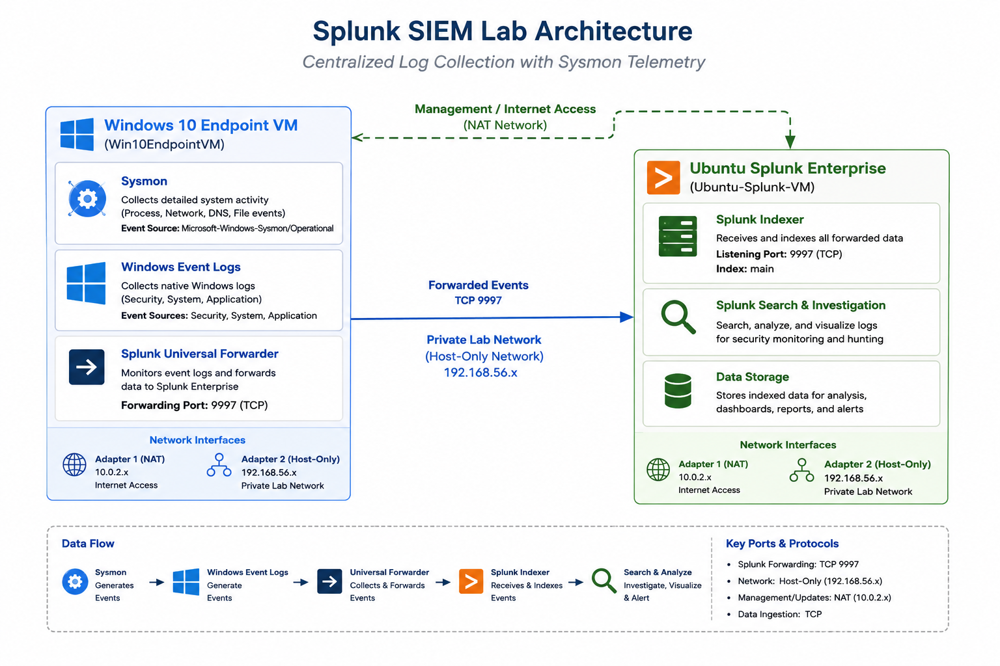
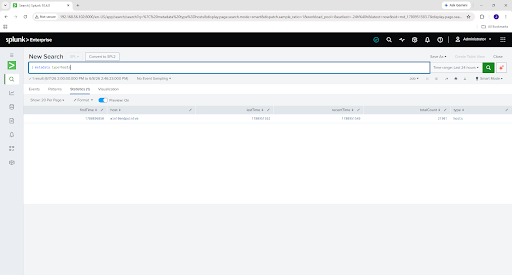
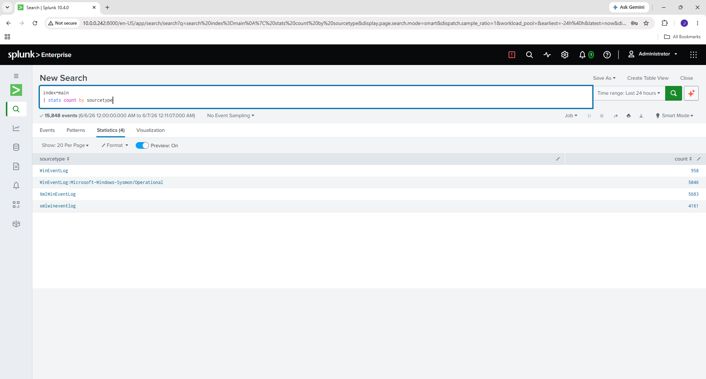
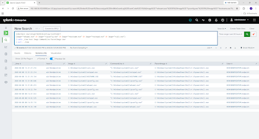
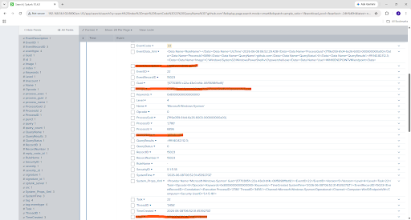
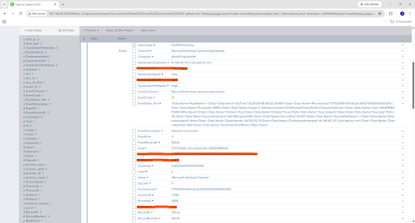

# Splunk SIEM Deployment and Endpoint Telemetry Analysis

## Overview

This project documents the deployment of a Splunk Enterprise Security Information and Event Management (SIEM) environment designed to centralize Windows endpoint telemetry using Sysmon and the Splunk Universal Forwarder.

The objective was to design, build, troubleshoot, and validate an end-to-end monitoring pipeline capable of supporting future detection engineering, threat hunting, alert development, and incident investigation activities.

---

## Architecture



The environment consists of a Windows 10 endpoint generating native Windows Event Logs and Sysmon telemetry, which is forwarded through the Splunk Universal Forwarder to a centralized Splunk Enterprise server hosted on Ubuntu Server.

---

## Technologies Used

* Splunk Enterprise 10.4
* Ubuntu Server
* Windows 10
* Sysmon
* Splunk Universal Forwarder
* Oracle VirtualBox
* SPL (Search Processing Language)

---

## Validation

### Endpoint Registration Validation



The following SPL query was used to verify endpoint registration:

```spl
| metadata type=hosts
```

This confirmed that the Windows endpoint was successfully connected and actively forwarding telemetry to Splunk.

---

### Data Source Validation



The following SPL query was used to validate available data sources:

```spl
index=main
| stats count by source
```

Validated data sources included:

* WinEventLog:Security
* WinEventLog:System
* WinEventLog:Application
* XmlWinEventLog:Microsoft-Windows-Sysmon/Operational

---

## Endpoint Telemetry Analysis

### Process Creation Investigation (Sysmon Event ID 1)



Sysmon Event ID 1 was used to investigate process execution activity, command-line arguments, parent-child process relationships, and user attribution.

Controlled activity included:

* whoami
* ipconfig
* hostname
* notepad
* calc

---

### DNS Query Investigation (Sysmon Event ID 22)



DNS telemetry was validated using:

```powershell
nslookup github.com
```

This demonstrated process-level visibility into DNS resolution activity and domain lookups.

---

### Network Connection Investigation (Sysmon Event ID 3)



Network telemetry was validated using:

```powershell
curl https://github.com
```

This demonstrated visibility into outbound network connections initiated by endpoint processes.

---

## Challenges Solved

During implementation, several issues required troubleshooting and root-cause analysis:

* Incorrect EVTX collection method resulting in binary data ingestion
* Sysmon forwarding permissions issues
* XML rendering configuration challenges
* Structured field extraction from Sysmon telemetry
* Historical telemetry cleanup and validation

---

## Skills Demonstrated

* SIEM Deployment and Administration
* Splunk Enterprise
* Sysmon Configuration
* Splunk Universal Forwarder
* Windows Event Logging
* Endpoint Telemetry Analysis
* SPL Query Development
* Root Cause Analysis
* Log Source Validation
* Security Monitoring
* Detection Engineering Fundamentals

---

## Full Technical Documentation

The complete project report is available here:

📄 **[Splunk SIEM Deployment and Endpoint Telemetry Analysis](report/Splunk_SIEM_Deployment_and_Endpoint_Telemetry_Analysis.pdf)**

---

## Author

**Jonah Bybee**

* LinkedIn: https://linkedin.com/in/jonah-bybee-1ab829333
* GitHub: https://github.com/Jonah-Bybee
